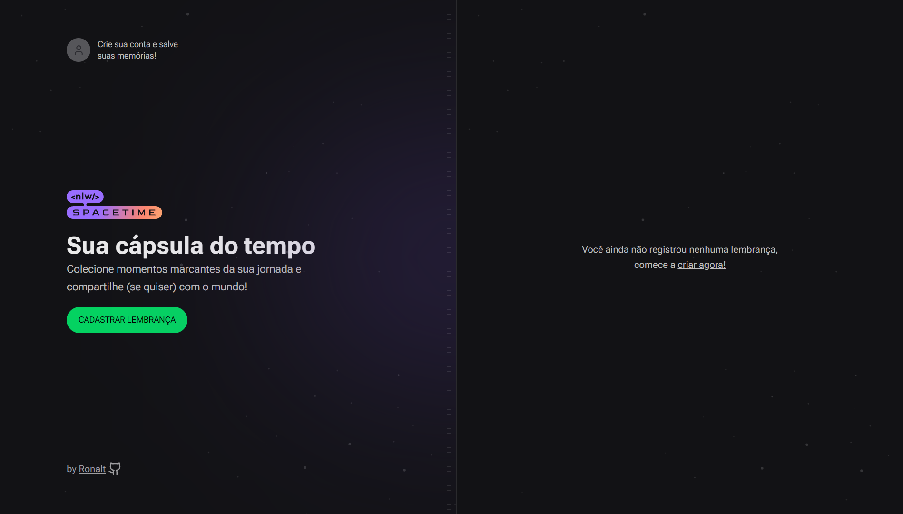

# NLW spacetime - Cápsula do tempo

Aplicação simula uma cápsula do tempo onde é possível guardar fotos de momentos importantes pra você, onde é possível deixa-los publicos ou privados. Login é feito pelo github.

# Screenshots

## Novas funcionalidads e deploy em breve:

* Página detalhes da memoria
* Link para compartilhar memoria
* Selecionar data da memoria
* Responsividade

**Principais Tecnologias utilizadas**:
`Node` , `Fastify`, `Prisma`, `TypeScript`, `JavaScript`, `Tailwindcss`